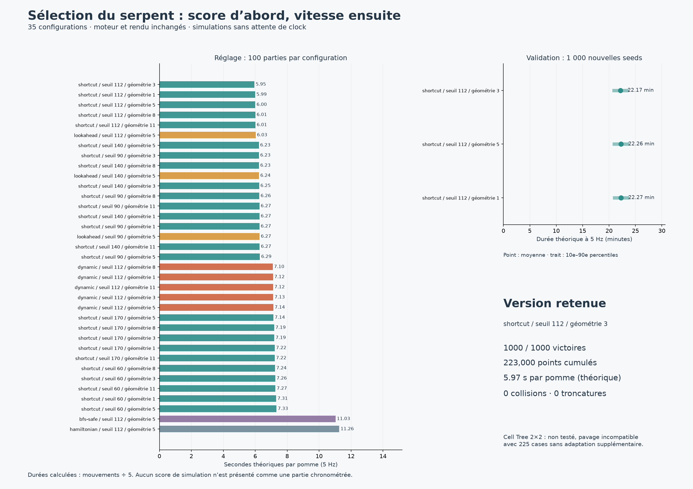

# Résultats de la sélection

Même moteur torique 15×15 et croissance différée. Durées théoriques à 5 Hz, non mesurées en partie réelle.

35 configurations sur 100 seeds (1000–1099), finalistes figés puis validation sur 1000 seeds (10000–10999).

Cell Tree 2×2 non testé : pavage incompatible avec 225 cases ; adaptation supplémentaire nécessaire.

## Validation

| Configuration | Score total | Victoires | Collisions | s/pomme théoriques | Durée moyenne (min) |
|---|---:|---:|---:|---:|---:|
| shortcut / seuil 112 / géométrie 3 | 223000 | 1000/1000 | 0 | 5.965 | 22.171 |
| shortcut / seuil 112 / géométrie 5 | 223000 | 1000/1000 | 0 | 5.990 | 22.264 |
| shortcut / seuil 112 / géométrie 1 | 223000 | 1000/1000 | 0 | 5.992 | 22.271 |

## Tous les essais de réglage

| Configuration | Score total | Victoires | Collisions | s/pomme théoriques |
|---|---:|---:|---:|---:|
| shortcut / seuil 112 / géométrie 3 | 22300 | 100/100 | 0 | 5.950 |
| shortcut / seuil 112 / géométrie 1 | 22300 | 100/100 | 0 | 5.995 |
| shortcut / seuil 112 / géométrie 5 | 22300 | 100/100 | 0 | 6.004 |
| shortcut / seuil 112 / géométrie 8 | 22300 | 100/100 | 0 | 6.009 |
| shortcut / seuil 112 / géométrie 11 | 22300 | 100/100 | 0 | 6.013 |
| lookahead / seuil 112 / géométrie 5 | 22300 | 100/100 | 0 | 6.029 |
| shortcut / seuil 140 / géométrie 5 | 22300 | 100/100 | 0 | 6.228 |
| shortcut / seuil 90 / géométrie 3 | 22300 | 100/100 | 0 | 6.233 |
| shortcut / seuil 140 / géométrie 8 | 22300 | 100/100 | 0 | 6.235 |
| lookahead / seuil 140 / géométrie 5 | 22300 | 100/100 | 0 | 6.238 |
| shortcut / seuil 140 / géométrie 3 | 22300 | 100/100 | 0 | 6.246 |
| shortcut / seuil 90 / géométrie 8 | 22300 | 100/100 | 0 | 6.257 |
| shortcut / seuil 90 / géométrie 11 | 22300 | 100/100 | 0 | 6.266 |
| shortcut / seuil 140 / géométrie 1 | 22300 | 100/100 | 0 | 6.266 |
| shortcut / seuil 90 / géométrie 1 | 22300 | 100/100 | 0 | 6.266 |
| lookahead / seuil 90 / géométrie 5 | 22300 | 100/100 | 0 | 6.272 |
| shortcut / seuil 140 / géométrie 11 | 22300 | 100/100 | 0 | 6.274 |
| shortcut / seuil 90 / géométrie 5 | 22300 | 100/100 | 0 | 6.293 |
| dynamic / seuil 112 / géométrie 8 | 22300 | 100/100 | 0 | 7.098 |
| dynamic / seuil 112 / géométrie 1 | 22300 | 100/100 | 0 | 7.117 |
| dynamic / seuil 112 / géométrie 11 | 22300 | 100/100 | 0 | 7.122 |
| dynamic / seuil 112 / géométrie 3 | 22300 | 100/100 | 0 | 7.129 |
| dynamic / seuil 112 / géométrie 5 | 22300 | 100/100 | 0 | 7.136 |
| shortcut / seuil 170 / géométrie 5 | 22300 | 100/100 | 0 | 7.139 |
| shortcut / seuil 170 / géométrie 8 | 22300 | 100/100 | 0 | 7.186 |
| shortcut / seuil 170 / géométrie 3 | 22300 | 100/100 | 0 | 7.195 |
| shortcut / seuil 170 / géométrie 1 | 22300 | 100/100 | 0 | 7.224 |
| shortcut / seuil 170 / géométrie 11 | 22300 | 100/100 | 0 | 7.224 |
| shortcut / seuil 60 / géométrie 8 | 22300 | 100/100 | 0 | 7.241 |
| shortcut / seuil 60 / géométrie 3 | 22300 | 100/100 | 0 | 7.255 |
| shortcut / seuil 60 / géométrie 11 | 22300 | 100/100 | 0 | 7.266 |
| shortcut / seuil 60 / géométrie 1 | 22300 | 100/100 | 0 | 7.312 |
| shortcut / seuil 60 / géométrie 5 | 22300 | 100/100 | 0 | 7.332 |
| bfs-safe / seuil 112 / géométrie 5 | 22300 | 100/100 | 0 | 11.031 |
| hamiltonian / seuil 112 / géométrie 5 | 22300 | 100/100 | 0 | 11.262 |

Chaque archive `.json.gz` contient tous les scores individuels, seeds, directions, jalons et temps de décision.
Les temps de calcul des lots dépendent de la concurrence CPU ; ils ne sont pas des temps de jeu.
Même seed ne signifie pas mêmes positions de pommes après divergence des corps.
La sélection compare les finalistes sur validation : elle ne constitue pas une estimation indépendante après sélection ni une preuve universelle de sûreté.

