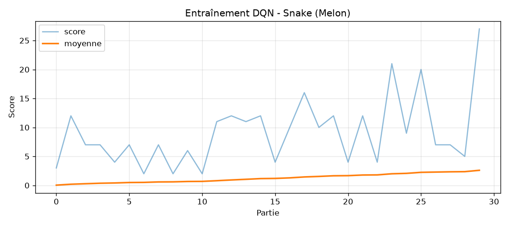

# Groupe Melon — Snake IA (Deep Q-Learning)

**Auteurs** : LAMECHE Nazim, DE-SOUSA Basile

## Installation (Python 3.13)

```bash
python -m pip install --upgrade pip
python -m pip install -r requirements.txt
```

## Utilisation

```bash
python serpent-algo.py train --games 300          # entraînement headless, clock accélérée (~10 min CPU)
python serpent-algo.py train --games 300 --render # idem avec affichage
python serpent-algo.py play                       # l'agent joue avec model.pth à la clock du socle (5 coups/s)
```

`train` produit `model.pth` (sauvegardé à chaque nouveau record), `training_log.csv` et `training_curve.png`.
`play` affiche le score et le temps réel, et imprime en console le ratio score/temps à la fin de la partie.

## Architecture (3 blocs du cours)

- **Game** — `SnakeGameAI` enveloppe le socle (`Snake`, `Apple`, visuel inchangés). `play_step(action) -> reward, game_over, score`. Action relative : `[tout droit, droite, gauche]`.
- **Model** — `Linear_QNet` 17 → 256 → 256 → 3 (torch), `QTrainer` (Adam, lr 0.001, γ 0.9, MSE sur l'équation de Bellman).
- **Agent** — `get_state`, `get_action` (ε-greedy décroissant sur 80 parties), `remember` (replay 100 000), `train_short_memory` / `train_long_memory` (batch 1000).

### État (17 entrées)
Les 11 du cours (danger devant/droite/gauche, direction ×4, pomme ×4) + 6 enrichissements :
espace atteignable (flood-fill) après chaque action ×3, et distance au corps dans chaque direction ×3.
La grille du socle est **torique** (modulo dans `move()`), donc la position de la pomme est calculée sur la distance torique la plus courte et le seul danger est le corps.

### Récompenses (modifiées, autorisé)
| Événement | Reward |
|---|---|
| Pomme mangée | +10 |
| Mort (auto-morsure) | −10 |
| Boucle (>100 × longueur coups sans pomme) | −10 |
| Fin du jeu (grille pleine) | +100 |
| Se rapprocher de la pomme | +0,3 |
| S'en éloigner | −0,4 |

Grille, clock du mode `play` et scoring (1 point/pomme) du socle : non modifiés.

## Résultats (entraînement de référence, 277 parties, ~10 min CPU)

- Record en entraînement : **103**
- Évaluation du modèle sauvegardé sur 30 parties (mode glouton) : moyenne **70,9**, médiane 74, min 32, max 96
- **11,5 coups par pomme** en moyenne → à 5 coups/s : **≈ 0,43 pomme/s** (ratio score/temps)



---

## Timeline

- 20h10 Lecture du readme
- 20h10 git clone
- 20h13 compréhension du système de calcul de score
- 20h13 deblayage du sujet avec IA
- 20h15 Code du Deep Q Learning avec IA
- 20h20 Trainning avec Clock accélérée
- 20h45 Lancement en parallèle d'un agent tier qui teste plusieurs paramètres de rewards
- 21h10 Utilisation des paramètres de rewards le plus efficient sur l'entrainement principal
- 21h40 Récupération des scores et le mettre dans le readme

## Pistes d'amélioration (pour le ratio)
- Réduire les coups par pomme : le shaping distance pousse déjà au chemin court ; un état avec la distance normalisée à la pomme (et pas seulement le signe) pourrait aider.
- Réseau cible (target network) et Double DQN pour stabiliser le plateau.
- Le ratio score/temps mesuré au game over avantage une mort précoce avec bon score : à clarifier avec l'enseignant (score à temps fixe ? score total / temps total ?).
