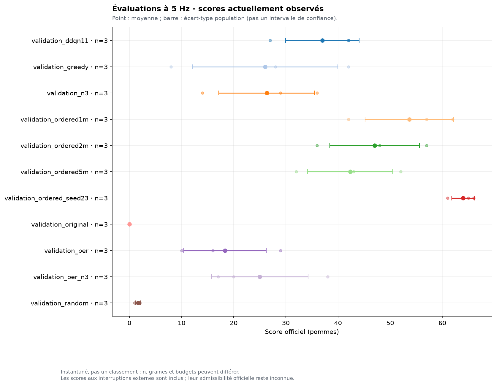
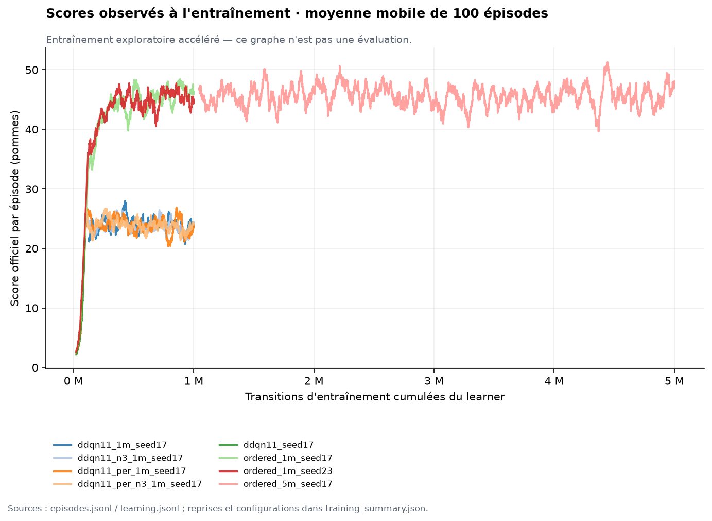

# Résultats mesurés — Snake RL

Rapport produit le 2026-09-16T21:09:42+02:00.

**Le programme et l’apprentissage fonctionnent ; la première place et la complétion ne sont pas démontrées.** Le maximum du moteur est 223 points. Les valeurs ci-dessous proviennent des fichiers de cette session, jamais des scores publiés dans les articles.

## Protocole

- Python 3.13.15, pygame 2.6.1, Torch 2.14.0, NumPy 2.5.3 ; CPU Apple M5 Pro, 18 cœurs logiques, 48 Gio ; Torch limité à un thread par entraînement.
- Entraînement accéléré autorisé par l’utilisateur. Aucun démonstrateur, filtre de sécurité ni planificateur dans l’agent RL.
- Validation : trois graines communes 10001–10003, 600 déplacements maximum par épisode, un mouvement par tick de la clock originale à 5 Hz. Processus de validation parfois concurrents.
- La borne de 600 est une interruption expérimentale ; elle ne constitue ni une défaite ni une victoire du jeu. Ces scores partiels ne sont pas présumés classables officiellement.
- Sélection locale : moyenne de score, médiane, quartile inférieur, complétions ; temps seulement en cas de distributions de scores identiques et de parties naturellement terminées. Ce n’est pas une règle d’agrégation officielle inventée.
- Test final : cinq graines réservées 20001–20005, cinq processus indépendants à 5 Hz chacun, sans entraînement concurrent, borne externe de 2000 déplacements ; aucun réglage ni nouveau choix de modèle à partir de ces résultats.
- Le temps est mesuré par time.time() à la collision, à la victoire ou à l’interruption, après un premier déplacement immédiat. Le chronomètre original ne se fige pas ; la convention exacte du professeur reste inconnue.
- Score, récompense RL et durée restent séparés. Les temps accélérés d’entraînement ne sont pas des temps officiels de partie.

## Comparaisons à budget identique

| Variante | n | Scores individuels | Moyenne | Médiane | Écart-type | Max | Collisions | Interruptions | Victoires |
|---|---:|---|---:|---:|---:|---:|---:|---:|---:|
| validation_ddqn11 | 3 | 42, 27, 42 | 37.00 | 42 | 7.07 | 42 | 2 | 1 | 0 |
| validation_greedy | 3 | 42, 28, 8 | 26.00 | 28 | 13.95 | 42 | 3 | 0 | 0 |
| validation_n3 | 3 | 36, 14, 29 | 26.33 | 29 | 9.18 | 36 | 3 | 0 | 0 |
| validation_ordered1m | 3 | 62, 42, 57 | 53.67 | 57 | 8.50 | 62 | 2 | 1 | 0 |
| validation_ordered2m | 3 | 48, 57, 36 | 47.00 | 48 | 8.60 | 57 | 2 | 1 | 0 |
| validation_ordered5m | 3 | 52, 43, 32 | 42.33 | 43 | 8.18 | 52 | 3 | 0 | 0 |
| validation_ordered_seed23 | 3 | 65, 66, 61 | 64.00 | 65 | 2.16 | 66 | 0 | 3 | 0 |
| validation_original | 3 | 0, 0, 0 | 0.00 | 0 | 0.00 | 0 | 0 | 3 | 0 |
| validation_per | 3 | 16, 10, 29 | 18.33 | 16 | 7.93 | 29 | 3 | 0 | 0 |
| validation_per_n3 | 3 | 38, 17, 20 | 25.00 | 20 | 9.27 | 38 | 3 | 0 | 0 |
| validation_random | 3 | 2, 1, 2 | 1.67 | 2 | 0.47 | 2 | 2 | 1 | 0 |

DDQN11, PER, n-step=3 et PER+n-step ont chacun un million de transitions, la même graine d’entraînement 17 et les mêmes hyperparamètres communs. Les variantes ordered utilisent 248 entrées et un MLP de 48 900 paramètres, contre 18 564 pour les onze informations. La seconde graine d’entraînement est 23. Les checkpoints à 2 et 5 millions prolongent celui à 1 million de la graine 17.

PER et n-step ne sont pas retenus par défaut : ils n’améliorent pas cette comparaison. L’amélioration de la représentation enrichie est celle du paquet entier (rang du corps, deltas toriques, dangers, rayons, croissance). L’ablation du rang seul n’a pas été faite : ces résultats n’isolent pas son effet causal. Le réseau sur la grille est un petit MLP sur grille aplatie ; aucun CNN n’a été comparé.

L’échantillon de validation est petit et plusieurs checkpoints sont comparés : le gagnant peut être optimiste. Les scores à 600 déplacements privilégient les progrès observables dans ce budget et ne prouvent pas le meilleur score éventuel sans limite. Il faut regarder les collisions et interruptions, pas seulement la moyenne.

## Modèle chargé par défaut

- Checkpoint : `checkpoints/selected.pt`, sélection `validation_ordered_seed23`.
- Source : `runs/ordered_1m_seed23/candidate_001000000.pt`.
- Entraînement : 1,000,000 transitions et 249,751 mises à jour ; encodeur `ordered`.
- SHA-256 livré : `3b3a0bf2cfb1e07e0c796a4439dec853d4e9519c1571f4876f991f31aaa93374`.
- Provenance et critères complets : `checkpoints/selection.json`. Les poids sont chargés sur CPU ; pas d’exploration ni de modification du checkpoint lors du jeu.
- `checkpoints/reference_classic11.pt` conserve la référence évaluée à onze informations, distincte du modèle choisi.

## Test final réservé

| Graine | Score | Temps mesuré (s) | Pas | Longueur finale | Fin |
|---:|---:|---:|---:|---:|---|
| 20001 | 74 | 173.542 | 853 | 77 | self_collision |
| 20002 | 69 | 144.991 | 713 | 72 | self_collision |
| 20003 | 51 | 96.307 | 474 | 54 | self_collision |
| 20004 | 64 | 124.876 | 614 | 67 | self_collision |
| 20005 | 47 | 90.133 | 444 | 50 | self_collision |

**n=5 ; moyenne 61.00 ; médiane 64 ; écart-type 10.37 ; minimum 47 ; maximum 74.**
Complétion : **0/5** ; collisions : **5/5** ; interruptions externes : **0/5**.

Aucun temps n’est moyenné entre des scores différents pour désigner un vainqueur. Les fichiers JSON/CSV conservent chaque association score–temps. Les comparaisons de durée à score strictement identique sont dans les summaries et dans le graphe dédié ; avec ces faibles effectifs, aucune supériorité temporelle générale n’est établie.

Cadence effective du test : 4.909 à 4.915 mouvements/s, avec le même clock.tick(5) que la source.
Latence moyenne d’une décision, moyennée sur les cinq parties : 0.536 ms.
Cette latence inférieure au tick ne prouve pas une réduction de la durée de jeu. Le score maximal n’étant pas atteint régulièrement, aucune optimisation temporelle au détriment de points n’a été retenue.

## Coût et courbes d’entraînement

| Session | Transitions supplémentaires | Compteur final | Updates cumulées | Durée de session (s) |
|---|---:|---:|---:|---:|
| ddqn11_1m_seed17 | 900,000 | 1,000,000 | 249,751 | 103.07 |
| ddqn11_n3_1m_seed17 | 1,000,000 | 1,000,000 | 249,750 | 114.85 |
| ddqn11_per_1m_seed17 | 1,000,000 | 1,000,000 | 249,751 | 289.15 |
| ddqn11_per_n3_1m_seed17 | 1,000,000 | 1,000,000 | 249,750 | 291.16 |
| ddqn11_seed17 | 100,000 | 100,000 | 24,751 | 10.08 |
| ordered_1m_seed17 | 1,000,000 | 1,000,000 | 249,751 | 160.52 |
| ordered_1m_seed23 | 1,000,000 | 1,000,000 | 249,751 | 180.40 |
| ordered_5m_seed17 | 4,000,000 | 5,000,000 | 1,249,751 | 669.25 |

Total effectivement collecté, sans recompter les préfixes repris : **10,000,000 transitions**. Somme des durées de session enregistrées : **1818.48 s** ; certaines sessions étaient concurrentes, cette somme n’est pas la durée murale de toute la mission.

Les durées couvrent la collecte et les mises à jour à partir du début instrumenté, sans le coût initial d’import de Python. Les checkpoints de reprise stockent replay/optimizer/RNG. Les premiers journaux de reprise DDQN11 indiquaient le temps de la session seule ; le tableau utilise délibérément les sessions séparées. Le pilote final cumule maintenant ce temps dans les checkpoints et les nouvelles lignes d’épisodes. La latence d’entraînement n’était pas instrumentée dans les premiers runs (champ null) ; les latences d’évaluation sont mesurées. Coût des démonstrations et de recherche dans un simulateur : zéro.

Les courbes sont des parties exploratoires accélérées, pas des évaluations officielles. Le dernier checkpoint n’est pas automatiquement choisi. Les losses, valeurs Q, gradients et transitions sont conservés dans learning.jsonl ; les états et cibles non finis provoquent une erreur.

## Baseline et portée du maximum

Le jeu initial n’avait aucun agent : sans intervention, il continue tout droit. Cette référence est conservée et mesurée. Random et greedy sont explicitement algorithmiques. Un cycle hamiltonien du tore sert également à la preuve constructive du maximum et aux fixtures de correction. Il n’a pas été chronométré sur une partie complète à 5 Hz, n’est pas le réseau livré et n’entre pas dans la sélection des modèles RL.

## Vérifications effectuées

- 38 tests unitaires et d’intégration réussis sous Python 3.13 ; rapport `runs/test_report.txt`.
- Parité avec la source sur 1000 graines ; collisions, queue, croissance différée, score 223, reset et pureté des observations.
- DDQN avec cible indépendante sans gradient, PER, poids d’importance, n-step, vrais terminaux et interruptions, copies, finitude, sauvegarde et reprise.
- Classement exact des trois exemples demandés ; aucun ratio score/temps dans la sélection.
- CPU, checkpoints absents/corrompus, fermeture de fenêtre, logs complets, absence d’apprentissage en évaluation et checkpoint non modifié.
- Python 3.13.15 / pygame.font vérifiés ; smoke test natif avec capture `runs/smoke.png`.
- Lancement sans argument et fermeture propre : preuve dans `runs/exact_launch.json` ; chemins testés depuis un autre répertoire.

## Points à confirmer et limites

Le professeur doit préciser l’agrégation de plusieurs essais, l’admissibilité des défaites/interruption, le relevé exact du temps, l’autorisation des poids préentraînés et des observations enrichies. L’utilisateur a bien autorisé entraînement accéléré et récompenses libres. Le programme n’atteint pas encore régulièrement le maximum ; il ne démontre donc ni complétion fiable ni première place. Les résultats ne suffisent pas à conclure qu’un autre budget de formation, une autre graine ou une autre architecture ne ferait pas mieux.

Les sources effectivement consultées et leurs niveaux de lecture figurent dans [RESEARCH.md](RESEARCH.md) ; les faits du moteur et les ambiguïtés du cours dans [RULES_AUDIT.md](RULES_AUDIT.md).
